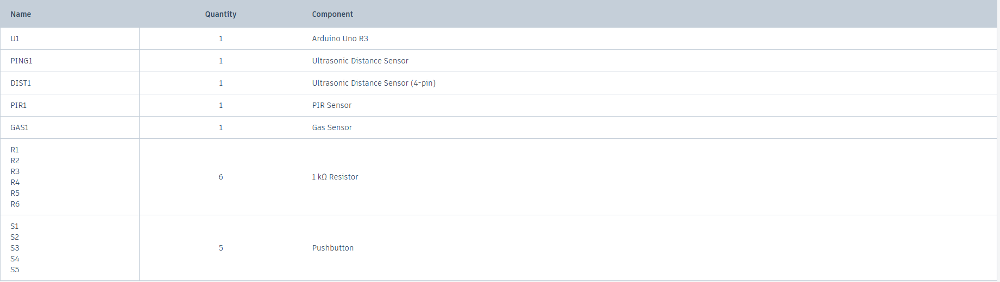
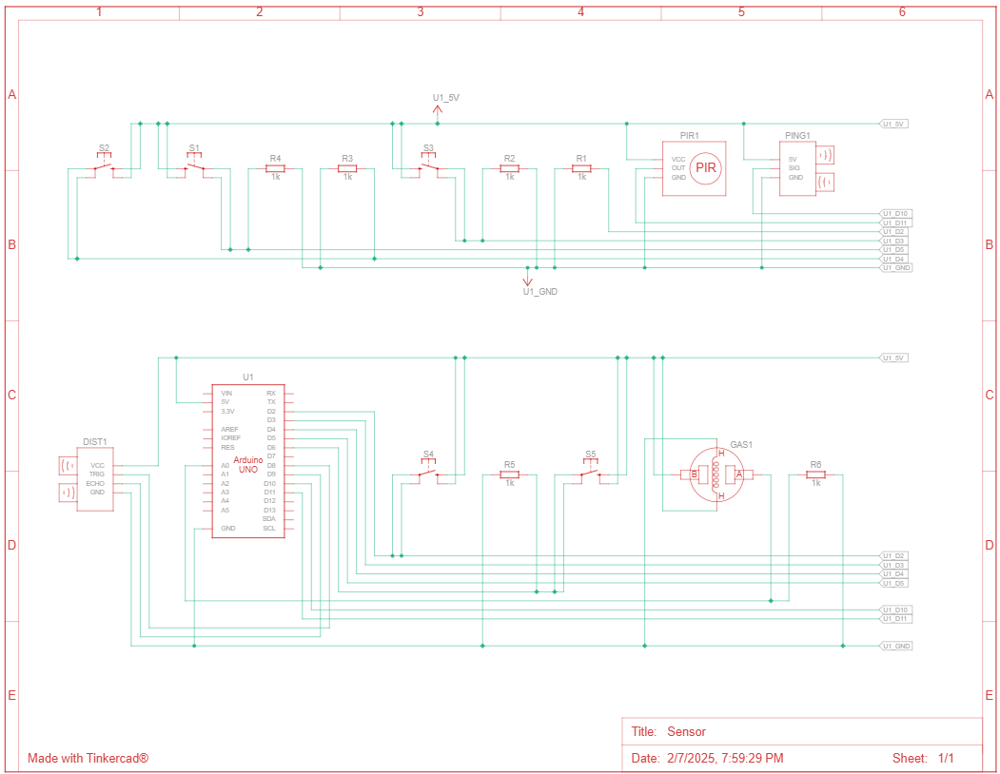
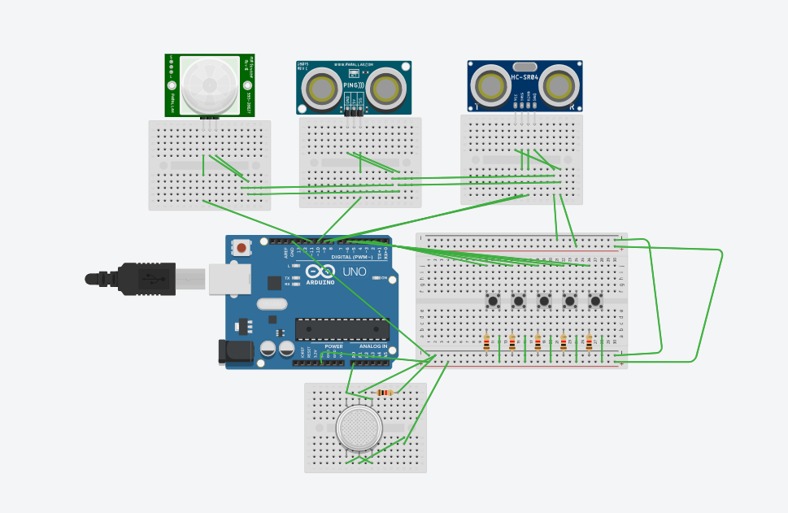

# Arduino Sensor

## Description

Learn arduino: Sensor 
This project use to learn about the sensor to use with arduino. All the sensor is in the sensor list below.
```
1. PIR sensor
2. Ultrasonic Distance Sensor (3 pin)
3. Ultrasonic Distance Sensor (4 pin)
4. Gas sensor
```
The project use 4 sensor with 5 button.
```
Button 1: Enable PIR sensor
Button 2: Enable Ultrasonic Distance Sensor (3 pin)
Button 3: Enable Ultrasonic Distance Sensor (4 pin)
Button 4: Enable Gas Sensor
Button 5: Disable the enable sensor.
```
The code and circuit is on link below:
```
Link tinkercad: https://www.tinkercad.com/things/7TV0646jwI1-sensor
Link github: https://github.com/longnhat2k9/arduino-sensor
```

## Social post

[https://www.instagram.com/arduinocollaboration2k9/](https://www.instagram.com/p/DF10lZrS664/)
[https://www.threads.net/@arduinocollaboration2k9?hl=en](https://www.threads.net/@arduinocollaboration2k9/post/DF10crtzy4_?hl=en)

## Component List


## Schematic View


## Circuit View

